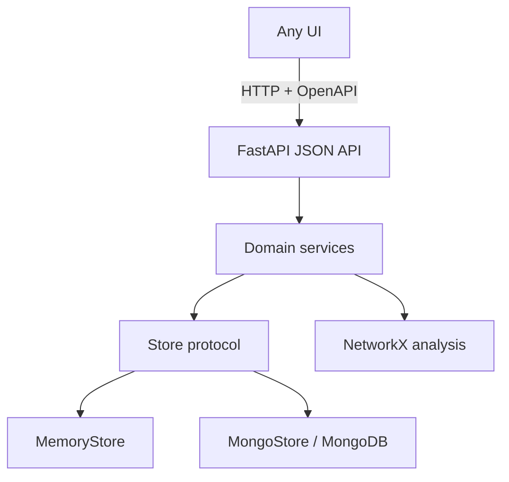

# Architecture

Ellensúly is a local-first, single-user application with a hard split between **datastore / domain** and **UI**.

## Why the split

The product will grow other surfaces: a second web client, a CLI, perhaps a print pack. Those clients must not know MongoDB, and the domain must not know React.

Rules:

- `backend/` has no HTML, no CSS, no graph-drawing library.
- `frontend/` has no Mongo driver and no copy of the analysis algorithms except instant path highlighting over data the API already returned.
- Teaching copy (glossary, lens descriptions, score caveats) is served by the API so alternative UIs inherit the same methodology.

Optional `view_state` on a DecisionGraph stores layout positions. It is a hint. Another UI may ignore it.

## Backend

- Python 3.12, FastAPI, Pydantic v2
- Official PyMongo async client (`AsyncMongoClient`)
- NetworkX for directed-graph metrics
- If MongoDB is unreachable at startup, the process uses `MemoryStore` so the app still runs

Graph analysis is cycle-safe: BFS with an explicit visited set; cycle membership via strongly connected components; `simple_cycles` only on small graphs.

## Frontend

- React 18, TypeScript, Vite
- React Flow (`@xyflow/react`) for authoring and custom node components (shape, rings, hatch, keyboard)
- ELK for layered layout, including cycle breaking for *display* — the stored graph still contains the cycle
- Zustand for local UI state (lens, selection, presentation)

React Flow was chosen over Cytoscape.js because:

- nodes must behave like small documents (shape, rings, badges, focus);
- WCAG keyboard access is far more realistic on DOM nodes than on a canvas;
- editing from the graph is a first-class workflow.

Analysis stays on the server, where Cytoscape would otherwise have been tempting.

## API resources

`/api/v1/graphs`, `/risks`, `/exposures`, `/actions`, `/relationships`, `/graphs/{id}/bundle`, `/graphs/{id}/analysis/*`, `/register`, `/search`, `/taxonomy`, `/config/assessment`, `/seed`.

The **bundle** is the payload a graph UI needs: entities + server-side analysis + methodology caveats.

## Local infrastructure

`docker compose up` starts MongoDB 7, the API, and an nginx-hosted UI that reverse-proxies `/api` and `/health`.
