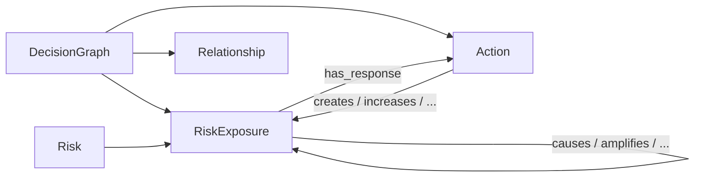

# Domain model

## DecisionGraph

A coherent decision context. Examples: supplier continuity, platform migration, product launch.

Fields: identity, title, description, objective, focal exposure ids, optional view-state (layout hints that alternative UIs may ignore), timestamps.

## Risk

The **canonical** underlying concept. Example: *Loss of engineering capacity*.

A Risk does **not** carry a universal probability. Likelihood is not a property of the idea; it is a property of an occurrence in context.

## RiskExposure

That Risk **in a particular DecisionGraph**, with a contextual description and an assessment.

The same Risk may appear:

- as several exposures (different assessments in different branches); or
- as one exposure reached by several branches (convergence).

Those are different modelling choices. The UI asks which one you mean when reusing a Risk.

## Action

A first-class response. Not a comment on an edge.

Conceptually: `RiskExposure → Action → RiskExposure`.

An Action has a treatment category (accept, avoid, mitigate, reduce, transfer, defer, other/custom) and a decision status (proposed, under consideration, selected, rejected, deferred, implemented). Categories are strings so a team can extend the vocabulary without a schema change.

An Action may affect several exposures. An exposure may have several alternative Actions.

## Relationship

A labelled, usually directed, edge. System verbs plus `custom` with a free-text label.

Action effects include: creates, increases, decreases, transfers, exposes, triggers, accelerates, delays, contains, removes, affects.

Exposure–exposure relations include: causes, contributes to, amplifies, suppresses, depends on, prerequisite for, correlated with (undirected).

**Counter-risk** is a user-facing idea, not a single edge type. It means an exposure that an action introduces, increases, exposes or otherwise makes relevant. The data model keeps the more precise verb.

## What we refused to collapse

| Distinct | Not the same as |
| --- | --- |
| Risk | RiskExposure |
| Proximity | Velocity |
| Confidence | Likelihood |
| Connectivity | Severity |
| Convergence on one exposure | Reuse of one Risk as several exposures |
| Counter-risk | “This action is wrong” |

## Identifiers and storage

Entities use UUID strings (the demonstration graph uses stable readable ids). MongoDB collections:

- `decision_graphs`
- `risks`
- `risk_exposures`
- `actions`
- `relationships`
- `assessment_config`

References, not embedding, so a canonical Risk can be reused across graphs without duplication.
